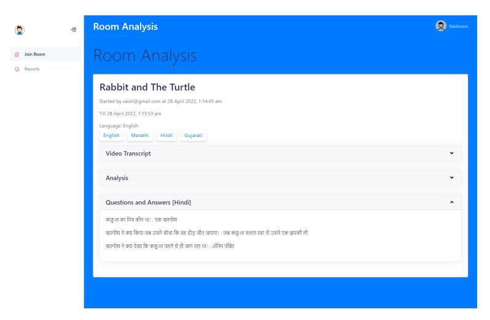

# Knowledge Extraction and Question Formation from Transcripts of Video

## Project Overview

This project focuses on extracting knowledge and generating questions from video transcripts. The implementation is divided into three key components: the video conferencing application server, the client, and the text processing, translation, and analysis module.

The video conferencing application utilizes technologies like WebRTC, web sockets, and API requests to set up the network for conducting meetings. Speech-to-text technology is employed to obtain transcripts of these meetings, and the transcripts and meeting data are stored in a MongoDB cloud database.

The text processing server plays a crucial role in this project. It performs extractive text summarization to extract relevant information from the meetings. What sets this algorithm apart is its use of the YAKE keyword extraction module to obtain intermediate candidate keyword scores.

## Key Components

- **Video Conferencing Application:** This component sets up the network for conducting meetings, utilizing technologies such as WebRTC, web sockets, and API requests.

- **Speech-to-Text Transcription:** The project employs speech-to-text technology to convert meeting content into textual transcripts.

- **MongoDB Cloud Database:** Transcripts and meeting data are securely stored in the MongoDB cloud database for future reference and analysis.

- **Text Processing Server:** This server is responsible for extractive text summarization, extracting relevant information from meeting transcripts using the YAKE keyword extraction module.

## How It Works

1. **Video Conferencing:** The video conferencing application facilitates meetings and collects video content for analysis.

2. **Transcription:** Speech-to-text technology converts spoken content into text transcripts.

3. **Storage:** Transcripts and meeting data are stored in the MongoDB cloud database.

4. **Text Processing:** The text processing server performs extractive text summarization, utilizing the YAKE keyword extraction module to identify candidate keywords.

5. **Knowledge Extraction:** Relevant information is extracted from the transcripts using the candidate keywords.

6. **Question Formation:** Based on the extracted knowledge, questions are automatically generated.

## Getting Started

Here you can provide instructions for others to run or test your project. Include any dependencies, installation commands, or steps to get the project up and running.

## Implementation and Results

## Contributing

If you are interested in contributing to this project, I welcome your input. Here's how you can get involved:

1. **Fork the Repository:** Create your own copy of the project by forking it.

2. **Make Changes:** Create a new branch, make your changes, and commit them.

3. **Submit a Pull Request:** Push your changes to your forked repository and submit a pull request to the main repository.

## Contact

If you have questions, suggestions, or would like to collaborate on this project, please feel free to reach out to me:

- Email: glendhingra27@gmail.com

I am dedicated to advancing knowledge extraction and question formation from video transcripts and value your support and contributions.

---

*This project is open-source and available under the [MIT License](LICENSE.md).*
